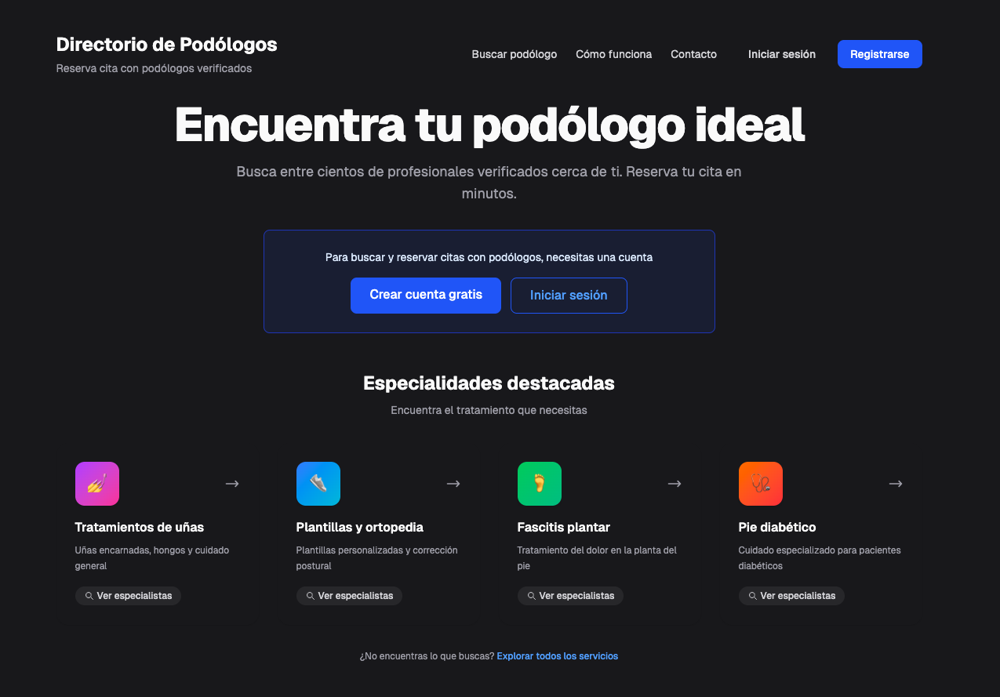
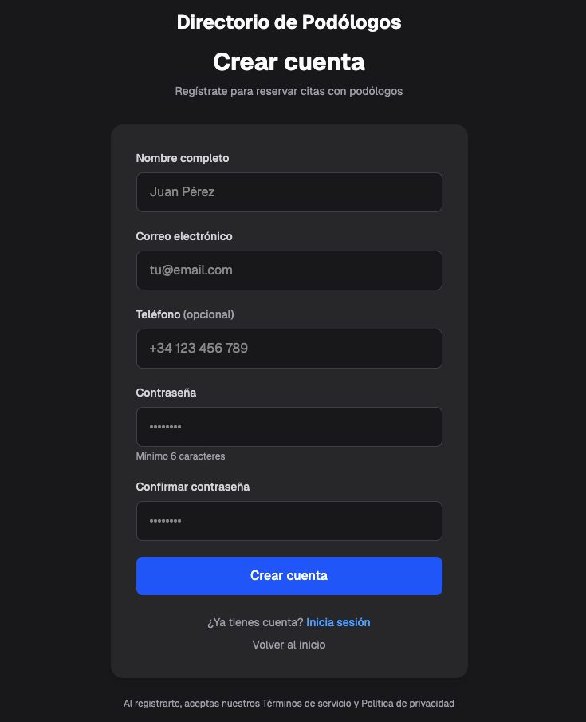
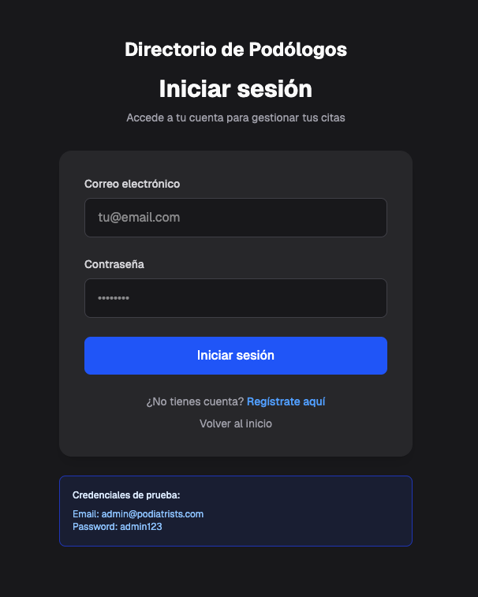
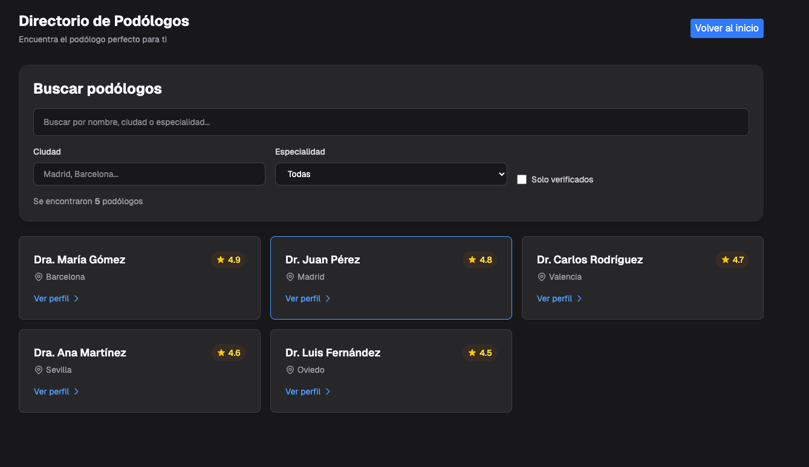
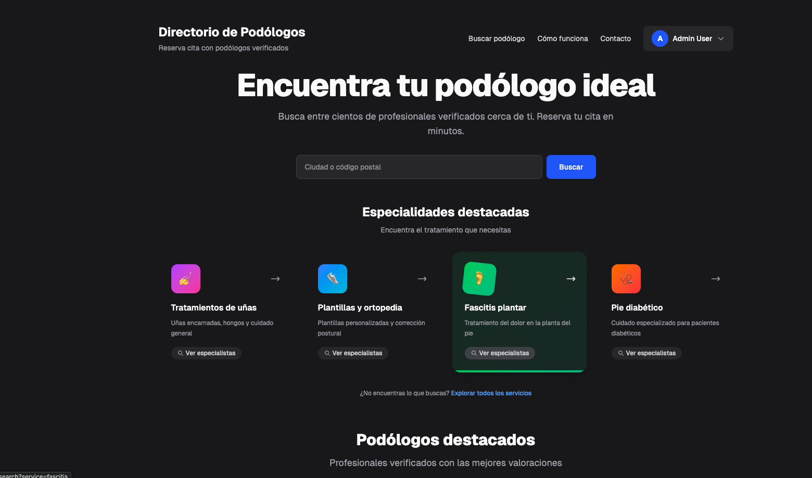

# directory_of_podiatrists — Monorepo

> Directorio profesional de podólogos con sistema de búsqueda avanzada y autenticación de usuarios.

Este repositorio contiene el frontend (Next.js) y el backend (NestJS) para el MVP del directorio de podólogos.

## 📸 Vista Previa del MVP

### Página de Inicio (Sin autenticación)

*Página principal con acceso público al directorio de podólogos*

### Página de Registro

*Sistema de registro de nuevos usuarios*

### Página de Inicio de Sesión

*Autenticación segura con JWT*

### Búsqueda de Podólogos

*Búsqueda avanzada con filtros por ubicación y especialidad*

### Página de Inicio (Estado de Carga)

*Interfaz con estados de carga optimizados*

---

## 🏗️ Estructura del Proyecto

- `client/` — aplicación Next.js (App Router, TypeScript)
- `server/` — API mock en NestJS (TypeScript)
- `pnpm-workspace.yaml` — definición de workspaces

## 🚀 Comandos Principales

```bash
# Instala dependencias para todo el monorepo
pnpm run setup

# Levanta cliente y servidor en paralelo (usa NEXT_PUBLIC_API_URL para proxy si es necesario)
pnpm run dev

# Levantar solo el servidor (reinicio rápido con ts-node-dev)
pnpm --filter server run dev:watch

# Ejecutar tests del cliente
pnpm --filter client run test
```

## ⚙️ Variables de Entorno

- `NEXT_PUBLIC_API_URL` — URL del backend (opcional). Si está definida, Next rewrites redirige `/api/*` hacia esa URL.
- `JWT_SECRET` — secreto para firmar JWT en el backend (por defecto `changeme`).

## 📚 Documentación

### Para Desarrolladores
- [`docs/ARCHITECTURE_SUMMARY.md`](./docs/ARCHITECTURE_SUMMARY.md) - Arquitectura completa del sistema
- [`docs/plans/INTEGRATION_GUIDE.md`](./docs/plans/INTEGRATION_GUIDE.md) - Guía de integración frontend-backend
- [`docs/plans/DATABASE_SETUP.md`](./docs/plans/DATABASE_SETUP.md) - Configuración de base de datos
- [`docs/CHECKLIST.md`](./docs/CHECKLIST.md) - Checklist de verificación

### Para IAs y Colaboradores

**Configuración Universal (Todas las IAs):**
- [`.ai/`](./.ai/) - Carpeta estándar con reglas y contexto
  - [`rules.md`](./.ai/rules.md) - Reglas del proyecto
  - [`context.md`](./.ai/context.md) - Contexto y estado
  - [`conventions.md`](./.ai/conventions.md) - Convenciones de código
  - [`prompts/`](./.ai/prompts/) - Prompts reutilizables

**Configuración Específica por IA:**
- [`.cursorrules`](./.cursorrules) - Para Cursor
- [`.windsurfrules`](./.windsurfrules) - Para Windsurf
- [`.clinerules`](./.clinerules) - Para Cline/Claude
- [`.github/copilot-instructions.md`](./.github/copilot-instructions.md) - Para GitHub Copilot

**Documentación Detallada:**
- [`docs/AI_COLLABORATION_GUIDE.md`](./docs/AI_COLLABORATION_GUIDE.md) - Guía completa
- [`docs/plans/README.md`](./docs/plans/README.md) - Índice de planes

### Planes de Desarrollo
- [01 - Autenticación](./docs/plans/01-authentication.md) ✅ Implementado
- [02 - Búsqueda de Profesionales](./docs/plans/02-search-professionals.md) ✅ Implementado
- [04 - Perfil de Profesional](./docs/plans/04-professional-profile.md) 📋 Pendiente
- [08 - Optimización de Búsqueda](./docs/plans/08-search-optimization.md) 📋 Pendiente
- [13 - SEO](./docs/plans/13-seo-performance.md) 📋 Pendiente
- [Ver todos los planes →](./docs/plans/README.md)

## 📝 Notas

- Backend: PostgreSQL + Prisma ORM
- Auth: JWT en cookies HTTP-only
- Búsqueda: Básica implementada, optimización pendiente
- Planes: Documentados en `/docs/plans/`

### Leyenda de Estados

- ⬜ Pendiente
- 🔄 En progreso
- ✅ Completado
